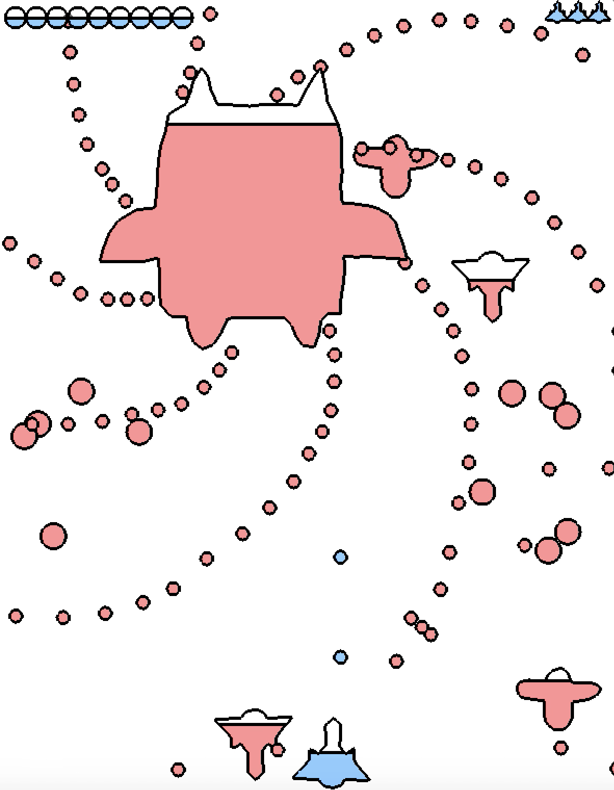
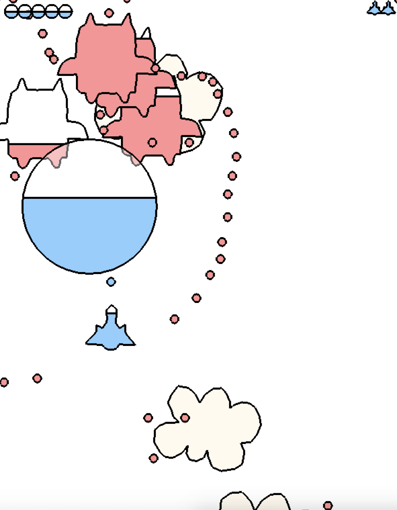
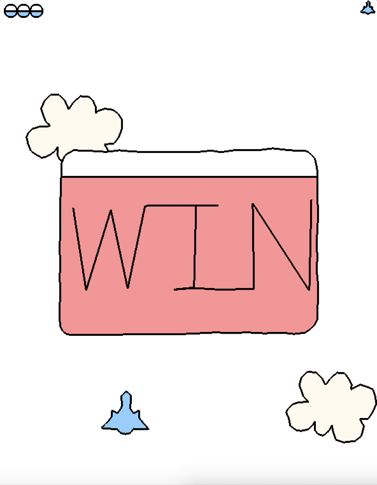

# AirCombat Red & Blue

A cute air combat game. The main mechanism: "red" and "blue" vanish when meeting each other.

It is a C++ programming exercise as it is written from scratch using only OpenGL and there is no advanced data structure involved.

The librararies yssimplesound and fssimplewindow are from Dr. Soji Yamakawa at http://ysflight.in.coocan.jp/.

<a href="https://youtu.be/-Ko-MaB1-nA"></a>
<a href="https://youtu.be/-Ko-MaB1-nA"></a>
<a href="https://youtu.be/-Ko-MaB1-nA"></a>

# Instructions for the Game
'esc':    exit

'up':     up

'down':   down

'left':   left

'right':  right

'space':  shoot

'a':      big shoot

# Build and Run the Project
## In MAC OS
If you have CMake,
```bash
mkdir build
cp -r data build
cd build
cmake ..
make
mkdir -p game.app/Contents/MacOS
mv game_main game.app/Contents/MacOS/exe
./game.app/Contents/MacOS/exe
```

If you do not have CMake, you can also do
``` bash
mkdir build
cp -r data build
cp -r include/ build
cp -r src/ build
cp fssimplewindow/macosx/* build
cp yssimplesound/yssimplesound.cpp build
cp yssimplesound/yssimplesound.h build
cp yssimplesound/macosx/* build
cd build
clang -c fssimplewindowobjc.m
clang -c yssimplesound_macosx_objc.m
mkdir -p game.app/Contents/MacOS
g++ -std=c++11 yssimplesound.cpp yssimplesound_macosx_cpp.cpp yssimplesound_macosx_objc.o fssimplewindowcpp.cpp fssimplewindowobjc.o Bullet.cpp ColorFunction.cpp ColorQuad.cpp Common.cpp ColorCircle.cpp ColorObj.cpp Colored.cpp StringPaser.cpp main.cpp -framework Cocoa -framework OpenGL -o game.app/Contents/MacOS/exe
./game.app/Contents/MacOS/exe
```
## In Linux
You can build in linux as follows. But the audio might not function normally. And the aircrafts do not have outlines.
```bash
mkdir build
cp -r data build
cd build
cmake ..
make
./game_main
```
